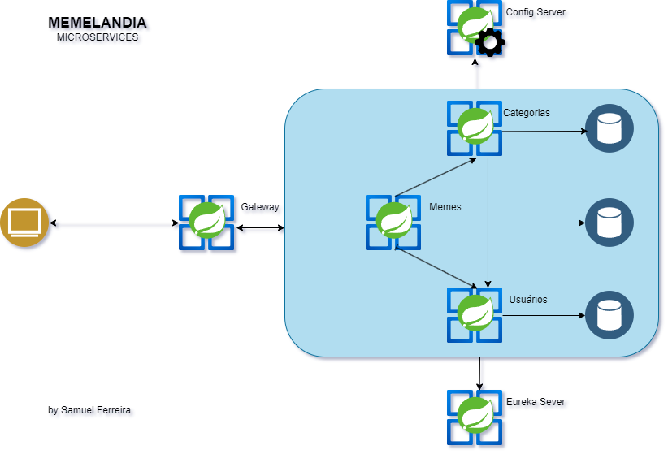
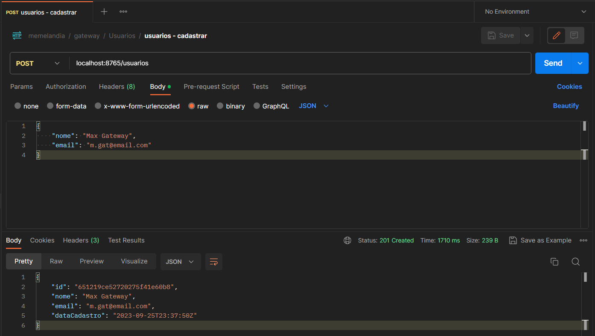
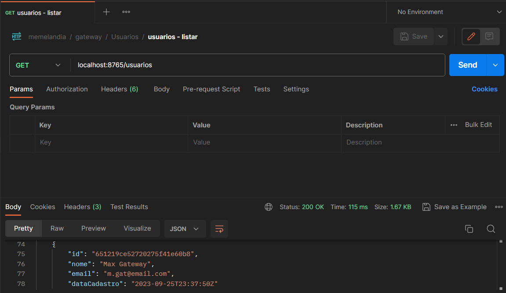
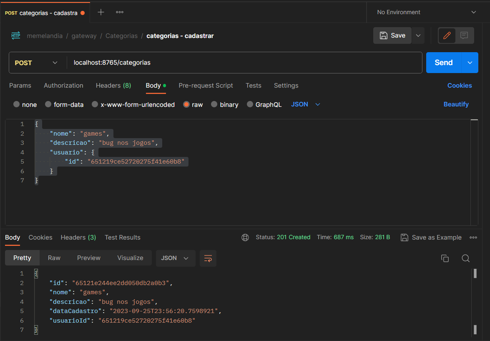
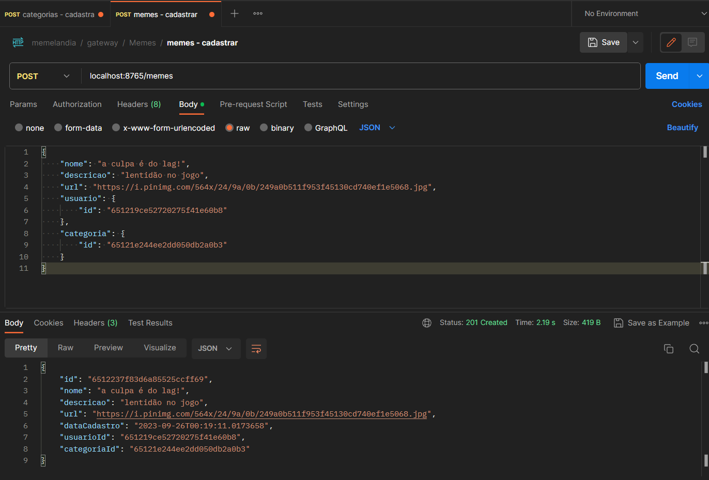
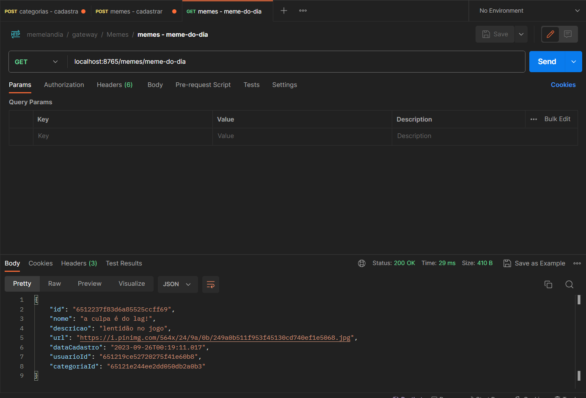

# Projeto Memelandia: Projeto Final do Curso Especialista Bac-End Java da EBAC


O projeto Memelandia é um sistema de gerenciamento de memes que foi desenvolvido com arquitetura de microsserviços. O objetivo do projeto é a migração de um sistema monolítico para microsserviços, a fim de melhorar a escalabilidade, a disponibilidade e a manutenibilidade do sistema.

## Principais Aspectos do Projeto

### Arquitetura de Microsserviços
A Memelandia está se movendo em direção a uma arquitetura de microsserviços, permitindo a modularização e independência de cada funcionalidade. Isso garante agilidade e escalabilidade.

### ConfigServer
Com o ConfigServer, as configurações da Memelandia são gerenciadas de forma centralizada, simplificando o controle das configurações em diferentes ambientes, garantindo flexibilidade e segurança.

### EurekaServer
O servidor de descoberta EurekaServer permite que os microsserviços se comuniquem de maneira dinâmica, facilitando a expansão e a integração contínua.

### Spring Cloud Gateway
O gateway Spring Cloud é a porta de entrada para os microsserviços da Memelandia, realizando roteamento inteligente, autenticação e balanceamento de carga para garantir um desempenho de alto nível.

### OpenFeign
A comunicação entre os microsserviços é simplificada e otimizada com o OpenFeign, permitindo a troca eficiente de informações.

### Persistência com Spring Data
A Memelandia utiliza o Spring Data para gerenciar a persistência de dados, proporcionando uma camada consistente e eficaz para acessar o MongoDB.

### Documentação com OpenAPI (Swagger)
A Memelandia está comprometida em oferecer uma documentação clara e acessível para suas APIs, facilitando o entendimento e a integração de parceiros e desenvolvedores.

### Tecnologias de Ponta
O projeto começou com o Spring Initializr, garantindo uma base sólida. A implementação é empacotada em contêineres Docker, tornando a implantação e o gerenciamento mais eficientes.

### Tratamento Avançado de Erros
Cada API da Memelandia é equipada com um sistema robusto de Exception Handler, garantindo que qualquer erro seja tratado de maneira adequada e que os usuários recebam respostas amigáveis e informativas.
```
{
    "status": 404,
    "type": "http://localhost/entidade-nao-encontrada",
    "title": "Entidade não encontrada",
    "detail": "Não existe um cadastro de usuario para o ID: 64ef8fc05351f24d87f98ef",
    "timestamp": "2023-09-26T00:39:01Z"
}
```

### Validações com Bean Validation
As entradas nas APIs são validadas com Bean Validation, garantindo a integridade dos dados e a segurança do sistema.
```
{
    "status": 400,
    "type": "http://localhost/dados-invalidos",
    "title": "Dados inválidos",
    "detail": "Um ou mais campos estão inválidos. Faça o preenchimento correto e tente novamente.",
    "timestamp": "2023-09-26T00:41:35.943535",
    "fields": [
        {
            "name": "nome",
            "userMessage": "não deve estar em branco"
        }
    ]
}
```

### Padrão DTO
O Padrão DTO é implementado para melhor estruturar os dados transmitidos entre as camadas do sistema, tornando o código mais organizado e legível.

## Vantagens

A migração do sistema para microsserviços trouxe as seguintes vantagens:

  * Melhoria da escalabilidade: Os microsserviços podem ser escalados de forma independente, o que permite que o sistema atenda a um maior número de usuários.
  * Melhoria da disponibilidade: Os microsserviços podem ser distribuídos em diferentes servidores, o que aumenta a disponibilidade do sistema.
  * Facilidade de manutenção: Os microsserviços são independentes, o que facilita a manutenção do sistema.

## Para testar o Projeto Memelandia

Com o Docker devidamente instalado crie um container MongoDB com o seguinte comando:
```
docker run -d -e MONGO_INITDB_ROOT_USERNAME=admin -e MONGO_INITDB_ROOT_PASSWORD=backend -p 27017:27017 --name mongodb mongo
``` 

Abra o Projeto Memelandia no Spring Tool Suite 4 e se atente para a ordem de start dos microservices que será da seguinte forma:
  1. ConfigServer
  2. ServiceDiscovery
  3. GatewayMeme
  4. UsuarioService
  5. CategoriaService
  6. MemeService

Com a utilização do Postman:

**a) Cadastre um Usuário;**

Crie um POST com a seguinte URL: localhost:8765/usuarios e no Body passe o o JSON:
``` 
{
    "nome": "Max Gateway",
    "email": "m.gat@email.com"
}
``` 
A resposta dessa requisição indicará como sucesso o código HTTP 201 - CREATED dessa forma:
``` 
{
    "id": "651219ce52720275f41e60b8",
    "nome": "Max Gateway",
    "email": "m.gat@email.com",
    "dataCadastro": "2023-09-25T23:37:50Z"
}
``` 
A imagem a seguir mostra a requisição e a resposta no Postman:



**b) Busque uma lista de Usuários;**

Crie uma requisição do tipo GET com a URL: localhost:8765/usuarios que retornará o usuário cadastrado conforme a imagem a seguir:



O microsserviço de usuários também permite buscar um usuário por id, atualizar e remover usuários.

**c) Cadastre uma Categoria de Meme;**

Crie um POST na URL: localhost:8765/categorias com o Body com o seguite JSON:
``` 
{
    "nome": "games",
    "descricao": "bug nos jogos",
    "usuario": {
        "id": "651219ce52720275f41e60b8"
    }
}
``` 
Cadastramos os campos "nome" e "descricão" e no objeto usuario passamos o apenas o "id", aproveitamos o "id" do usuário que foi cadastrado anteriormente. A resposta desse post pode ser conferido na imagem a seguir:



Da mesma forma como fizemos com o microsserviço de usuários, podemos fazer um GET na URL: localhost:8765/categorias para obtermos uma lista de categorias cadastradas.

**d) Cadastrando um Meme;**

Crie um POST na URL: localhost:8765/memes com o body com o seguinte JSON:
``` 
{
    "nome": "a culpa é do lag!",
    "descricao": "lentidão no jogo",
    "url": "https://i.pinimg.com/564x/24/9a/0b/249a0b511f953f45130cd740ef1e5068.jpg",
    "usuario": {
        "id": "651219ce52720275f41e60b8"
    },
    "categoria": {
        "id": "65121e244ee2dd050db2a0b3"
    }
}
``` 
Cadastramos os campos "nome" e "descricão" e os IDs dos objetos usuario e categoria que foram cadastrados anteriormente. A resposta desse post pode ser conferido na imagem a seguir:



É interessante testar o endpoint "meme do dia" através da URL: localhost:8765/memes/meme-do-dia que busca de forma aleatória um meme na base de dados.



## Próximos passos

Os próximos passos do projeto são:

  * Melhoria do desempenho: O desempenho do sistema será melhorado através da otimização da comunicação entre os microsserviços.
  * Melhoria da segurança: O sistema será melhorado em termos de segurança, através da implementação de mecanismos de autenticação e autorização.
  * Implantação: O sistema será implantado em um cluster Kubernetes.
