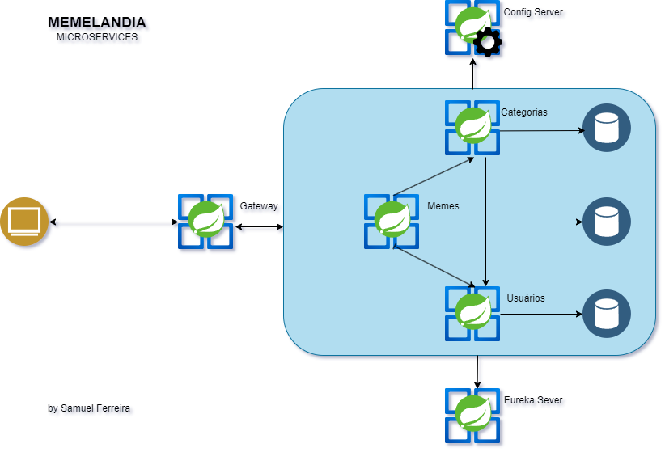

# Projeto Memelandia: Projeto Final do Curso Especialista Bac-End Java da EBAC

O projeto Memelandia é um sistema de gerenciamento de memes que foi desenvolvido com arquitetura de microsserviços. O objetivo do projeto é a migração de um sistema monolítico para microsserviços, a fim de melhorar a escalabilidade, a disponibilidade e a manutenibilidade do sistema.

## Principais Aspectos do Projeto

### Arquitetura de Microsserviços
A Memelandia está se movendo em direção a uma arquitetura de microsserviços, permitindo a modularização e independência de cada funcionalidade. Isso garante agilidade e escalabilidade.

### ConfigServer
Com o ConfigServer, as configurações da Memelandia são gerenciadas de forma centralizada, simplificando o controle das configurações em diferentes ambientes, garantindo flexibilidade e segurança.

### EurekaServer
O servidor de descoberta EurekaServer permite que os microsserviços se comuniquem de maneira dinâmica, facilitando a expansão e a integração contínua.

### Spring Cloud Gateway
O gateway Spring Cloud é a porta de entrada para os microsserviços da Memelandia, realizando roteamento inteligente, autenticação e balanceamento de carga para garantir um desempenho de alto nível.

### OpenFeign
A comunicação entre os microsserviços é simplificada e otimizada com o OpenFeign, permitindo a troca eficiente de informações.

### Persistência com Spring Data
A Memelandia utiliza o Spring Data para gerenciar a persistência de dados, proporcionando uma camada consistente e eficaz para acessar o MongoDB.

### Documentação com OpenAPI (Swagger)
A Memelandia está comprometida em oferecer uma documentação clara e acessível para suas APIs, facilitando o entendimento e a integração de parceiros e desenvolvedores.

### Tecnologias de Ponta
O projeto começou com o Spring Initializr, garantindo uma base sólida. A implementação é empacotada em contêineres Docker, tornando a implantação e o gerenciamento mais eficientes.

### Tratamento Avançado de Erros
Cada API da Memelandia é equipada com um sistema robusto de Exception Handler, garantindo que qualquer erro seja tratado de maneira adequada e que os usuários recebam respostas amigáveis e informativas.

### Validações com Bean Validation
As entradas nas APIs são validadas com Bean Validation, garantindo a integridade dos dados e a segurança do sistema.

### Padrão DTO
O Padrão DTO é implementado para melhor estruturar os dados transmitidos entre as camadas do sistema, tornando o código mais organizado e legível.

## Vantagens

A migração do sistema para microsserviços trouxe as seguintes vantagens:

  * Melhoria da escalabilidade: Os microsserviços podem ser escalados de forma independente, o que permite que o sistema atenda a um maior número de usuários.
  * Melhoria da disponibilidade: Os microsserviços podem ser distribuídos em diferentes servidores, o que aumenta a disponibilidade do sistema.
  * Facilidade de manutenção: Os microsserviços são independentes, o que facilita a manutenção do sistema.

## Próximos passos

Os próximos passos do projeto são:

  * Melhoria do desempenho: O desempenho do sistema será melhorado através da otimização da comunicação entre os microsserviços.
  * Melhoria da segurança: O sistema será melhorado em termos de segurança, através da implementação de mecanismos de autenticação e autorização.
  * Implantação: O sistema será implantado em um cluster Kubernetes.

O Projeto Memelandia está no caminho certo para se tornar uma referência em inovação e eficiência. Com uma arquitetura de microsserviços moderna e um conjunto de tecnologias de última geração, a Memelandia está pronta para continuar encantando os amantes de memes em todo o mundo, oferecendo uma experiência única e envolvente.
